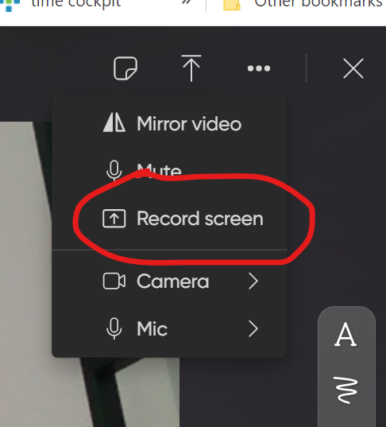

# Character Explorer

## Introduction

Welcome to the programming homework on building an Angular application to explore favorite comic and movie characters!

In this assignment, you will have the opportunity to put your skills in Angular and Web APIs to the test by creating an application that allows users to browse and learn about their favorite characters from various franchises.

To get started, you will need to have a good understanding of Angular and Web API concepts. You should also be familiar with the Angular framework, including its component-based architecture and the use of services and dependencies.

Throughout this assignment, you will have the chance to demonstrate your problem-solving skills as you design and implement the various features of the application. You will also have the opportunity to showcase your creativity by designing an attractive and user-friendly interface for the application.

## Functional Requirements

1. Display a list of characters: The application should display a list of characters from a variety of franchises, such as Disney, My Little Pony, Pokemon, Marvel Heroes, etc.
2. Search for characters: Users should be able to search for characters by name.
3. View character details: When a user clicks on a character, the application should display detailed information about the character, such as their name, appearance, abilities, and background story. Also display at least one image of the character.
4. Save list of favorite characters. The user should be able to quickly navigate these favorite characters' details.
5. Make the web app look nice and colorful.

## Non-Functional Requirements

* Implement the API access in Angular service(s).
* Use Angular interceptors for injecting API keys.
* Use Angular injection tokens for constants like API keys and base URLs.
* The list of characters view and the details view have to be different Angular routes.
* Check in your source code into GitHub. **Do not** check in API keys!
* Create a short screen video presenting your solution (1-3 minutes) on [flow.com](https://flip.com/dfd7c322).

  

## Technical Tips

* Store the list of favorite characters in a cloud database like Airtable or in the browser's local storage (e.g. [Window.localStorage](https://developer.mozilla.org/en-US/docs/Web/API/Window/localStorage)).
* For the details view, use a [*route parameter*](https://angular.io/guide/router#getting-route-information) to pick the character to display (e.g. *http://localhost:4200/characters/4711* to display details about character *4711*).

## Sample APIs

* https://pokeapi.co/
* https://ponyweb.ml/
* https://disneyapi.dev/
* https://developer.marvel.com/
* https://github.com/public-apis/public-apis#games--comics
