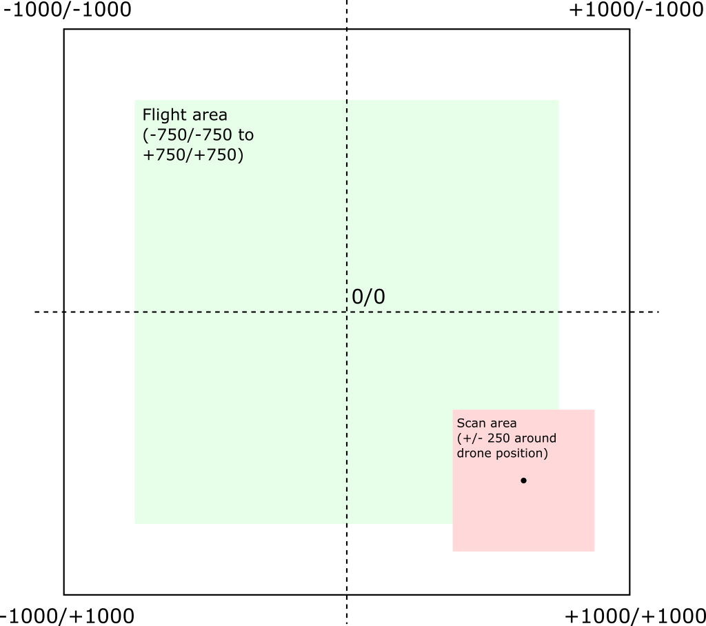

# Forest Manager

## Introduction

You are working as a forester. Trees in your forest suffer because the amount of rain falling in your region is constantly decreasing because of climate change. You acquired 10 specialized drones that can scan the trees from the air and detect potentially damaged ones. After detection, you have to manually inspect all of them.

You forest has a square shape with a side length of approx. 2km. Your forester base with all the drones in it is exactly in the middle (0/0). Drones can fly 750m in each direction. When scanning, the drone scans a square area with a side length of approx. 500m. The following image illustrates the coordinate system:

Each drone has a drone ID (1 to 10). Before flying, you must activate the drone. When done, you must fly the drone home and shut it down.

## The API

The drones are controlled using the API that you can find in the [DroneApi](./DroneApi/) folder. Of course this API only simulates drones.

* Run the API locally with `dotnet run`.
* After starting the API, you can take a look at the API specification at [http://localhost:5110/swagger/index.html](http://localhost:5110/swagger/index.html).

Once you managed to start the API, take a close look at the API specification and try to understand how it works. You can manually try the API calls in the specification document.

**Note** that the API does **not** persist any data. Data is only kept in memory. If you apply any changes (e.g. mark a tree as examined), the data is reset if you stop and restart the API. However, the locations of the trees remain the same, even between restarts of the API.

## Minimum Requirements

Write an Angular web app to support forester work. Here are the user stories that your web app must fulfill.

1. As a forester, I must be able to inspect which of my 10 drones are currently active and which are shut down.
   * For active drones, the web app has to display their current location.
2. As a forester, I must be able to activate a currently inactive drone. I also must be able to shut down a currently active drone.
3. As a forester, I must be able to enter my current location, pick one of the active drones and fly it to my current location.
4. As a forester, I must be able to pick one of the active drones and scan the area around it.
   * The app has to display the coordinates of all potentially damaged trees that resulted from the scan.
5. As a forester, I must be able to enter my current location and mark the tree I examined there so that the system does not lead me to this tree again.

Designing the UI and routes for the web app is part of the exercise.

## Advanced Requirements

1. After the scan (step 4 in minimum requirements), the app should not show me all damanged trees. Instead, it must tell me where the **nearest** damaged tree is (based on [*Manhattan Distance*](https://en.wikipedia.org/wiki/Taxicab_geometry)). It also has to tell me the relative distance to my position (i.e. how many meters I have to go up/down in y direction and left/right in x direction to reach the tree).
2. Combine steps 3 and 4 from minimum requirements so that the forester picks an active drone, enters her location and only has to press a single button to...
   * ...fly the drone to the forester's location,
   * ...scan the area around the location, and
   * ...display the nearest damaged tree (location and relative distance)
3. As a forester, I typically always go to the nearest, damaged tree that the system suggests (see previous step) and examine it.
   * Therefore, I want to have a single button *Manually Examined* to mark the tree as examined **without** me having to re-enter the location.
   * Next, it should only take a single button click to repeat step 1 for the nearest, damaged tree **without** me having to re-enter the location.

Designing the UI and routes for the web app is part of the exercise.
