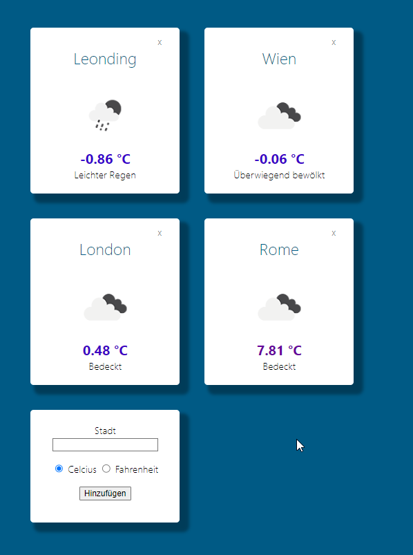

# Weather Dashboard

## Introduction

This mini-project is about creating a weather dashboard.

## Requirements

The weather dashboard has to offer the following functionality:

* Let the user add cities for which she would like to see the current weather.
* Use the web API of [geoapify.com](https://geoapify.com) (free plan) to get latitude and longitude for a given city.
  * [Documentation](https://apidocs.geoapify.com/docs/geocoding/forward-geocoding/#about)
  * Sample request: `https://api.geoapify.com/v1/geocode/search?text=Leonding,%20Austria&format=json&apiKey=YOUR-API-KEY`
* Use the web API of [openweather.org](https://openweathermap.org/) (free plan) to get the current weather at the location of the city.
  * [Documentation](https://openweathermap.org/current)
  * Sample request: `https://api.openweathermap.org/data/2.5/weather?lat=48.2793314&lon=14.2487457&lang=de&units=metric&appid=YOUR-API-KEY`
* Store the selected cities in an *Airtable* database
* Store the relevant parts of the results of the web API calls mentioned about in the *Airtable* database, too. Use this data store as a cache to minimize API calls. Only call the APIs if the cached data is older than 30 minutes.

## User Experience

Functionality is more important than design. However, once the functionality is done, try to make your dashboard look nice. Here is a sample design to spark ideas for UI design:

You can try this app [here](https://typescript-nhedu3.stackblitz.io) (note: this prototype is for demonstration purposes only, it has not been implemented using Angular).

Tip: You can get the icons shown in the prototype from `http://openweathermap.org/img/wn/${icon}@2x.png`. The value for `icon` is returned in the JSON body from the *openweather.org* API.

## Non-Functional Requirements

* Use the latest version of Angular
* Do **not** check in any API keys in GitHub!
